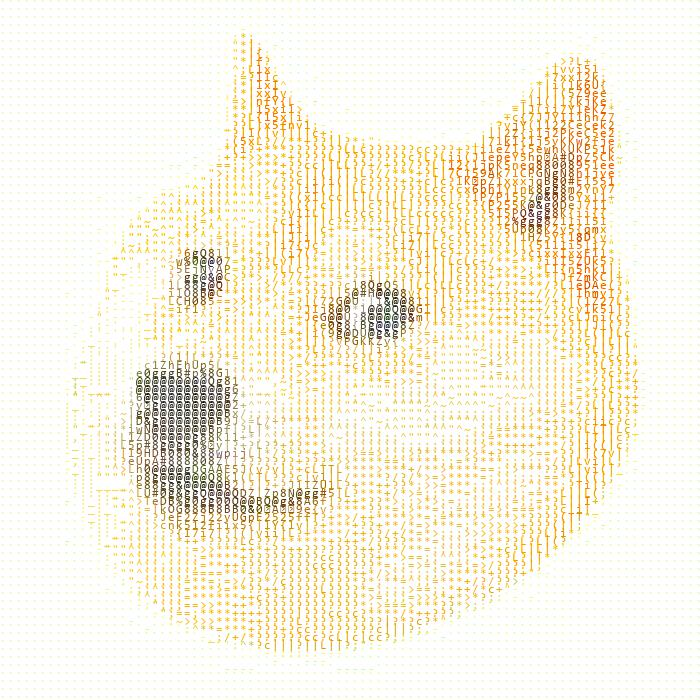

# 将图片转成字符

## 1. 像素灰度值与字符的映射关系

选用的字符集是ASICC码，可以输出字符的范围在33到128之间。
将这之间的每个字符都写入到一张空白的灰度图片上，计算每个字符图片上的像素，就可以得到每个字符需要的像素数。
再将字符对应的像素数拉伸填充到0-255之间，就可以得到灰度与字符的映射关系

## 2. 将图片转成字符图

先将需要转换的图片转化成灰度图片，再遍历灰度图片的像素点，利用灰度值与字符的映射关系将像素转化成字符，再将字符按照对应的位置写到另一张图片上，整个工作就完成了。写入的时候还可以将字符变成原像素的色彩，这样最后生成的图片也是彩色的。

需要注意的是，计算字符灰度与写入图片时要使用等宽的字体，这样生成的图片会比较规整饱满。

